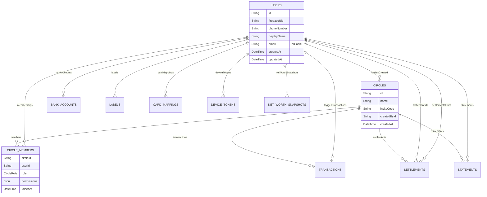
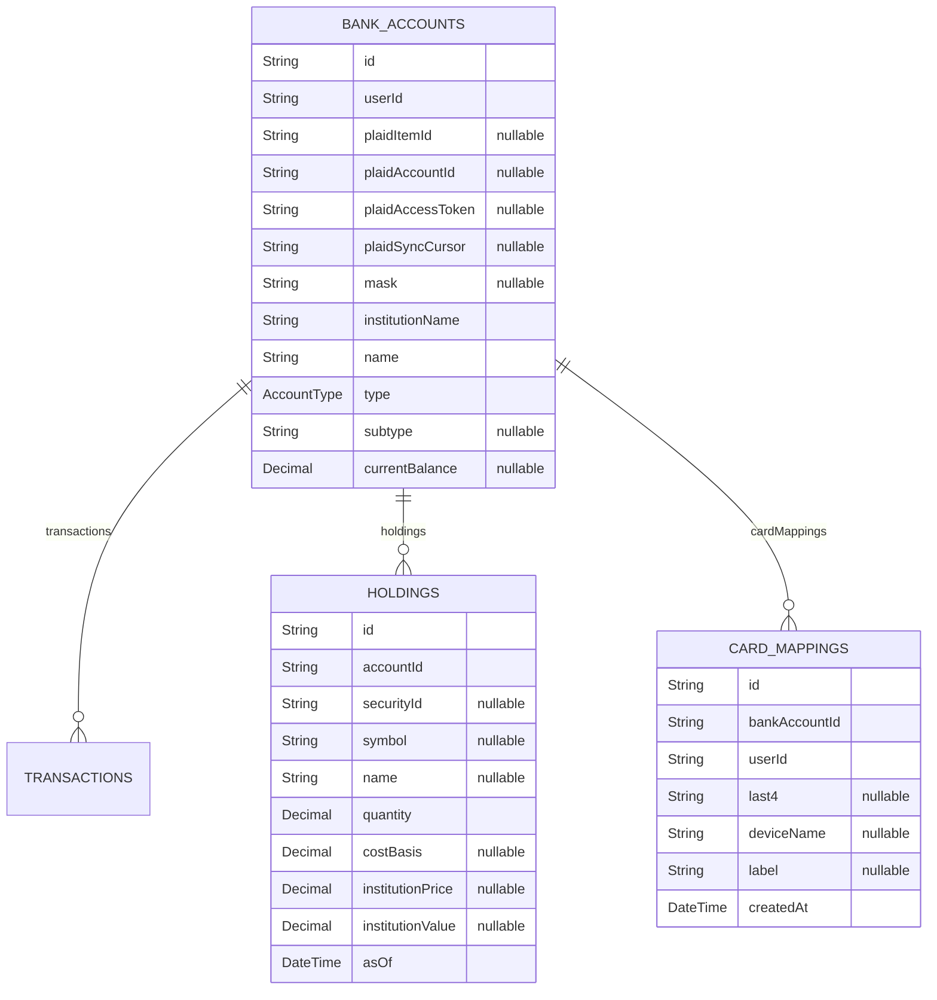
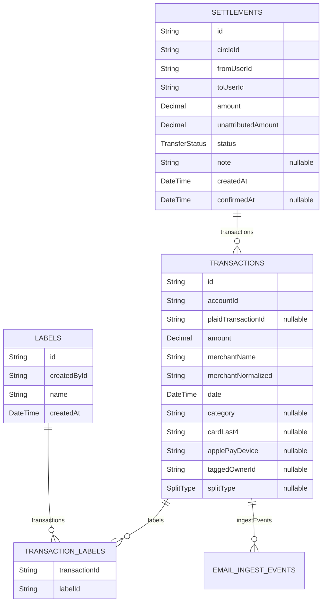
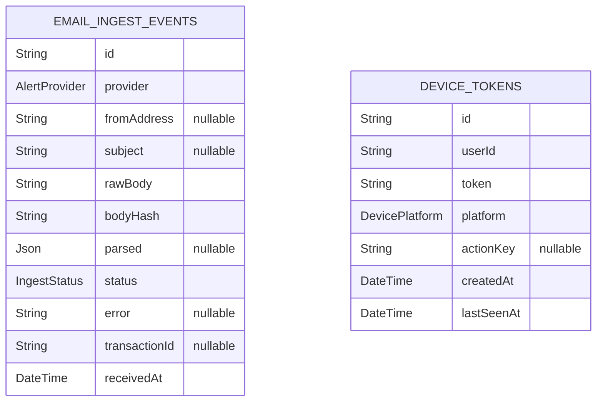
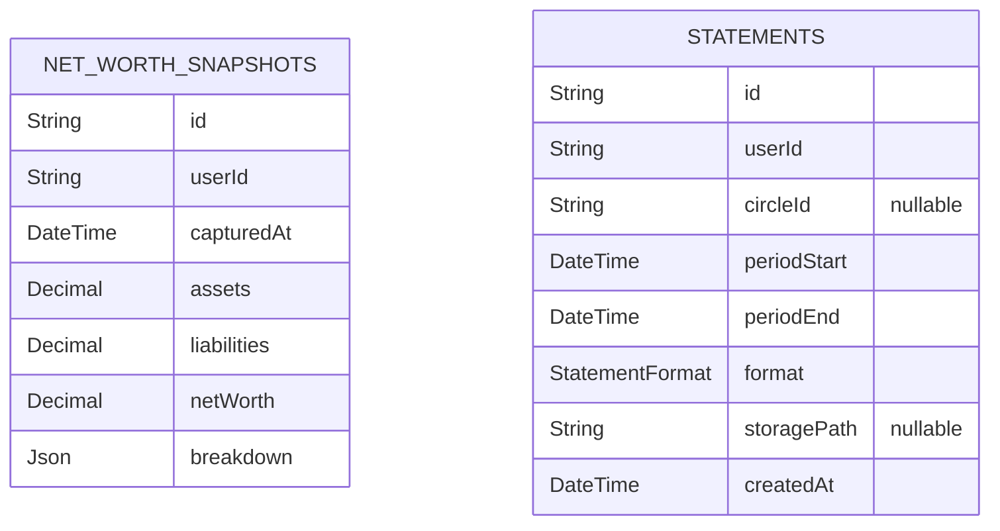

# trackify — database schema

> Generated from `src/models/schema.prisma` by `scripts/schema-docs.mjs`.
> Do not edit by hand — `npm run db:docs` regenerates it.

Money convention: amounts are `Decimal` at rest, integer cents in code, and
**NULL means unknown, never zero**.

## Identity & Circles

## Banking & Positions

## Ledger

## Ingestion & Devices

## Reporting

## All tables

| Model | Table | Columns | Relations out |
|---|---|---|---|
| User | `users` | 7 | Circle, CircleMember, BankAccount, Transaction, Label, CardMapping, DeviceToken, NetWorthSnapshot, Settlement, Settlement, Statement |
| Circle | `circles` | 5 | CircleMember, Transaction, Settlement, Statement |
| CircleMember | `circle_members` | 5 | — |
| BankAccount | `bank_accounts` | 18 | Transaction, Holding, CardMapping |
| CardMapping | `card_mappings` | 7 | — |
| Transaction | `transactions` | 21 | TransactionLabel, EmailIngestEvent |
| Label | `labels` | 4 | TransactionLabel |
| TransactionLabel | `transaction_labels` | 2 | — |
| Holding | `holdings` | 10 | — |
| NetWorthSnapshot | `net_worth_snapshots` | 7 | — |
| Settlement | `settlements` | 10 | Transaction |
| Statement | `statements` | 8 | — |
| DeviceToken | `device_tokens` | 7 | — |
| EmailIngestEvent | `email_ingest_events` | 11 | — |
